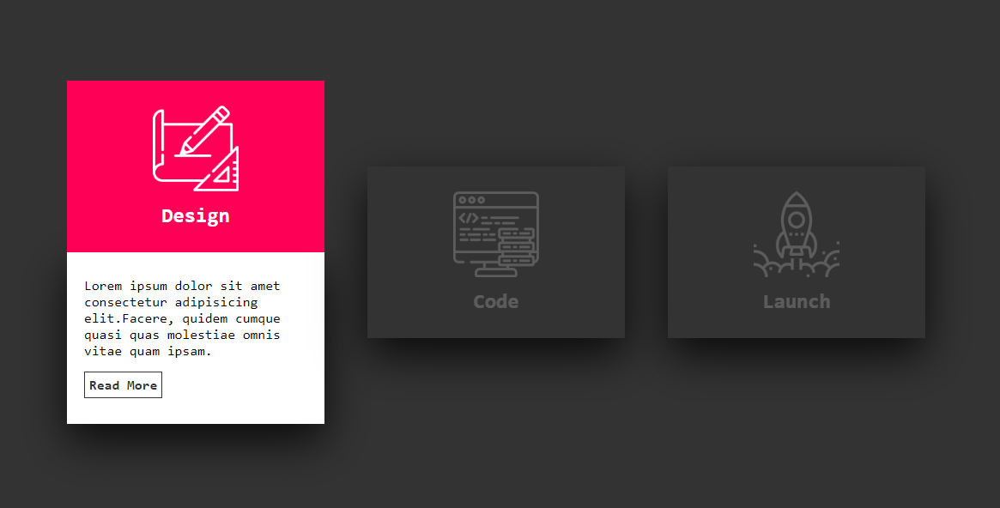
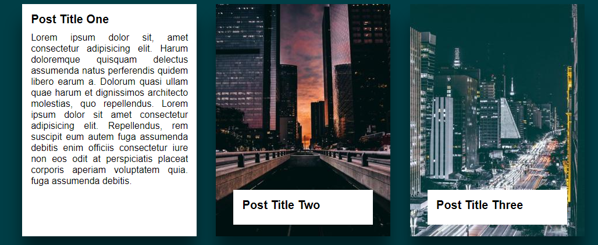
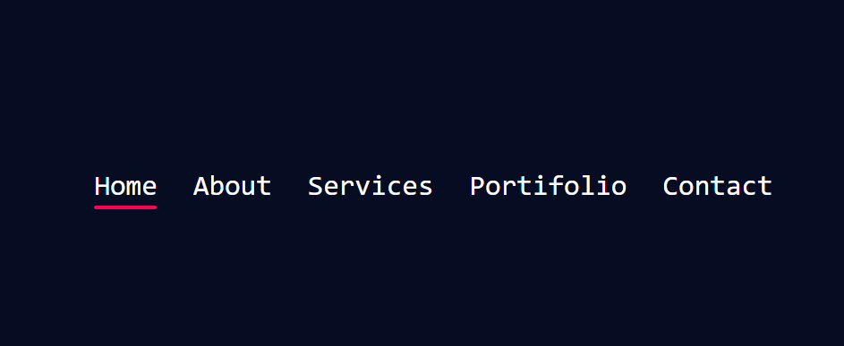
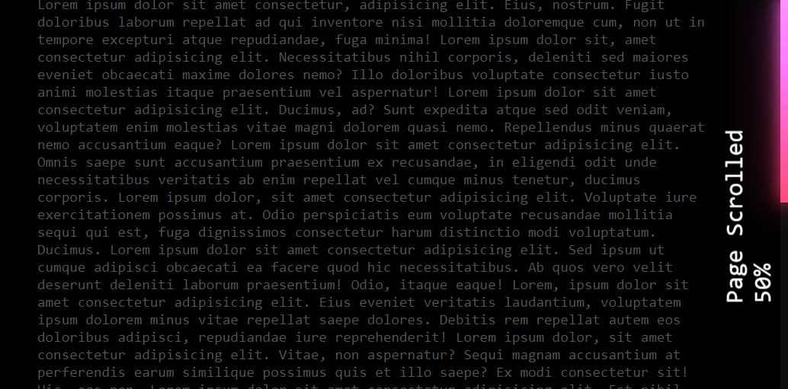

<h1>Projects CSS</h1>

  <h4>CSS Creative Box Border Hover Effects</h4>
  
Nesse projeto aprendi como atribuir algumas propriedade apenas uma vez, em momentos e cards direfentes.    Com isso novas tags e propriedades em HTML e CSS. 

   
  

    Referencia - Canal: Online Tutorials : 
  

  

    CSS Skewed Border - https://www.youtube.com/watch?v=-1U62fdmCk4&list=LLg3JmVOYDTF8jVdc9CJ60Yg&index=7&t=0s
  

  <h4> CSS Card Hover Effects</h4>
  
E neste projeto aprendi novos efeitos que as propriedades do CSS permite de fazer. E também como fazer rota de classes, utilizando o HTML e CSS.

    
  
 
    Referencia - Canal: Online Tutorials : 
  

  

    CSS Card Hover Effects - https://www.youtube.com/watch?v=EZqhWu8GJ6U&list=LLg3JmVOYDTF8jVdc9CJ60Yg&index=5
  

  <h4>How To Make It Responsive | CSS Card Hover Effects</h4>
  
Neste projeto fiz um Post Hover com uma breve descrição em lorem e imagem principal que pode mudar de acordo com o tema de outros sites e diversos estilos. Foi utilizado HTML e CSS. 

    
  

    Referencia - Canal: Online Tutorials :
  

  
 
    CSS Card Hover Effects - https://www.youtube.com/watch?v=9pXGz6Dv3q0
  

  

    How To Make It Responsive | CSS Card Hover Effects - https://www.youtube.com/watch?v=L4jbuKFJXaw
  

  <h4>Creating Animated Sliding Menu Indicator</h4>
  
Neste projeto aprendi a fazer um menu deslizante na versão clara e escura. Utilizando HTML, CSS e JavaScript.

    
   

    Referencia - Canal: Online Tutorials :
  

  
 
    Creating Animated Sliding Menu Indicator - https://www.youtube.com/watch?v=nGdwRP9ZsA4
  

  <h4>Creative Page Scroll Progress Bar with Number Percentage</h4>
  
Neste projeto aprendi como fazer o Javascript calcular em porcentagem de acordo com a rolagem da pagina, coloquei também a barra de rolagem em neon, que aprendi fazer no CSS. Foi utilizado HTML, CSS e JavaScript.

    
 

    Referencia - Canal: Online Tutorials :
  

  
 
    Creative Page Scroll Progress Bar with Number Percentage - https://www.youtube.com/watch?v=cL_dytFgasA&t=37s
  

